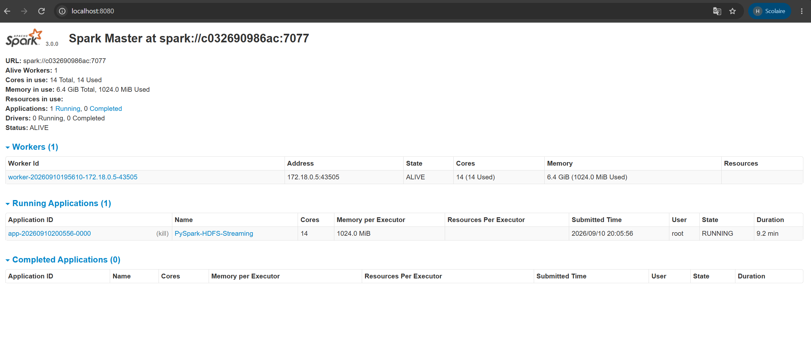
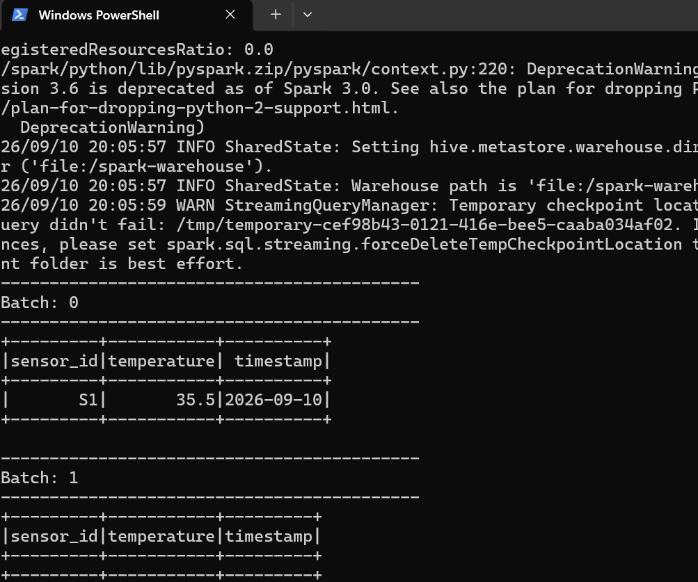

# TP4 : Traitement de Données en Temps Réel avec PySpark et HDFS

## Description
Mise en place d'un cluster Big Data avec Docker pour le traitement en temps réel des données de capteurs. Le projet utilise HDFS pour le stockage et PySpark Structured Streaming pour la détection d'anomalies de température (température > 30.0).

## Architecture du Cluster
- Hadoop NameNode (Ports : 9870, 9000)
- Hadoop DataNode (Port : 9864)
- Spark Master (Ports : 8080, 7077)
- Spark Worker (Port : 8081)

## Fichiers du Projet
- docker-compose.yml : Configuration des services Docker.
- hadoop.env : Variables d'environnement pour HDFS.
- app.py : Script PySpark Streaming.
- .gitignore : Fichiers ignorés lors du push.

## Instructions d'Exécution

1. Démarrer le cluster Docker :
docker compose up -d

2. Créer le dossier d'entrée dans HDFS :
docker exec -it namenode hdfs dfs -mkdir -p /data/input

3. Lancer l'application PySpark Streaming :
docker cp app.py spark-master:/app.py
docker exec -it spark-master /spark/bin/spark-submit --master spark://spark-master:7077 /app.py

4. Envoyer un fichier de test vers HDFS :
echo '{"sensor_id": "S1", "temperature": 35.5, "timestamp": "2026-09-10"}' > test1.json
docker cp test1.json namenode:/test1.json
docker exec -it namenode hdfs dfs -put /test1.json /data/input/

## Captures d'Écran

### 1. Spark Master Web UI

### 2. Résultat du Streaming Temps Réel

